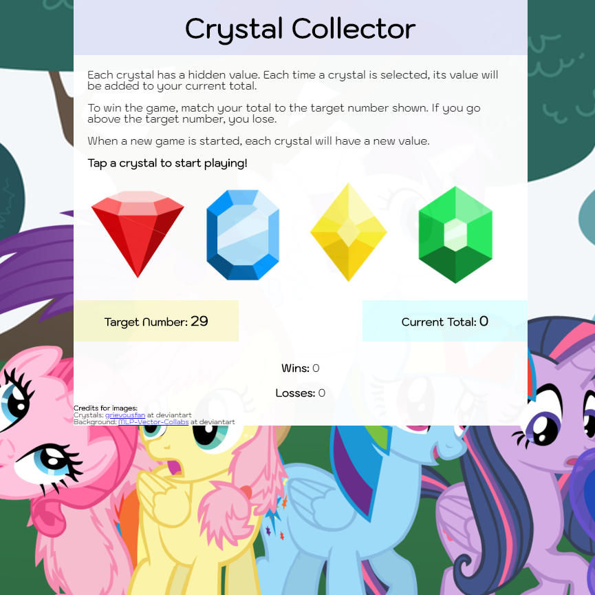
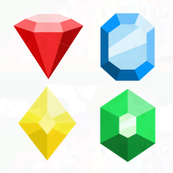

# Crystal Collector

## [Go to deployed app](https://plsenh.github.io/CrystalCollector/)

---

## Games Rules

1. Each crystal has a hidden value. Each time a crystal is selected, its value will be added to your current total.

2. To win the game, match your total to the target number shown. If you go above the target number, you lose.

3. When a new game is started, each crystal will have a new value.

## Built With

- [JavaScript](https://developer.mozilla.org/en-US/docs/Web/JavaScript) - High-level programming language.
- [VSC](https://code.visualstudio.com/) - Visual Studio Code is a source code editor developed by Microsoft.

## Author

- **Pauline Senh** - [plsenh](https://github.com/plsenh)

  

